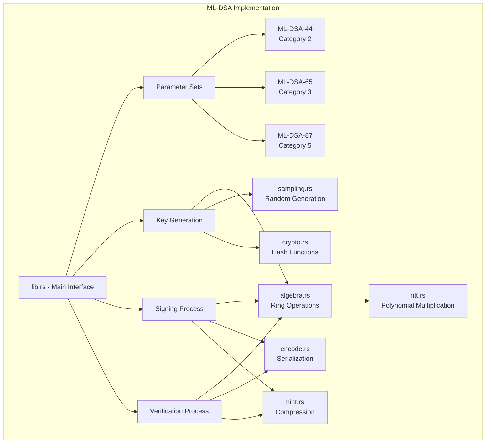
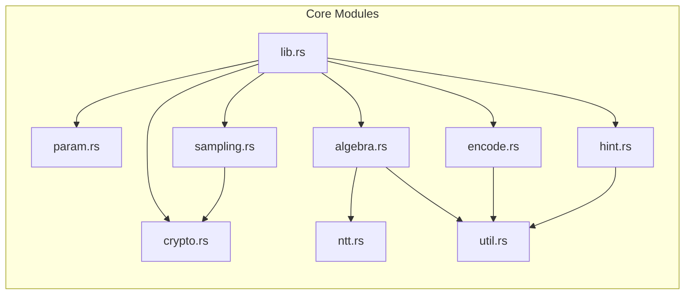
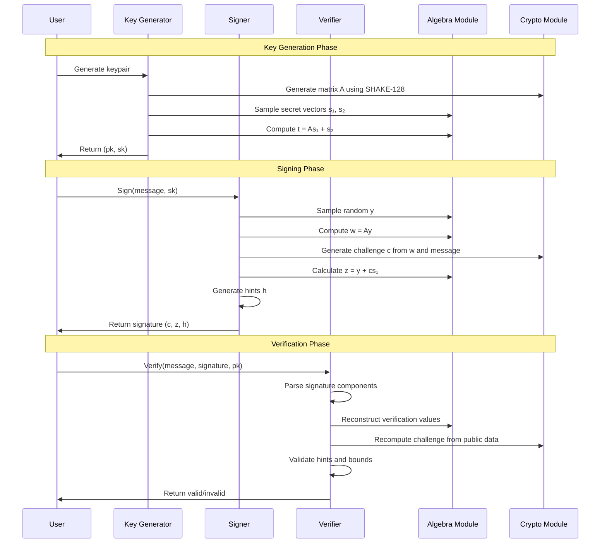
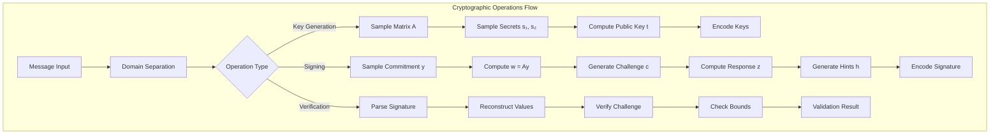
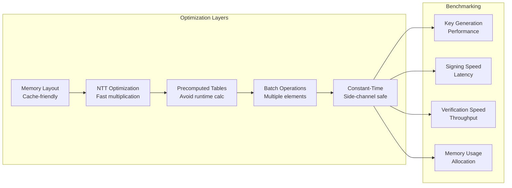

# ML-DSA Architecture Documentation

## Overview

This document describes the architecture and design of the ML-DSA (Module-Lattice-Based Digital Signature Standard) implementation in Rust. ML-DSA is the standardized version of CRYSTALS-Dilithium, following the FIPS 204 specification.

## Core Architecture

### System Overview

### Module Dependencies

### Parameter Sets

ML-DSA defines three security levels with different parameter sets:

- **ML-DSA-44**: Category 2 security (equivalent to AES-128)
- **ML-DSA-65**: Category 3 security (equivalent to AES-192)  
- **ML-DSA-87**: Category 5 security (equivalent to AES-256)

Each parameter set defines:
- Matrix dimensions (k × l)
- Signature size bounds
- Security parameters (η, γ₁, γ₂, τ, β)

### Core Components

#### 1. Algebraic Operations (`src/algebra.rs`)

Implements ring element operations over R_q = Z_q[X]/(X^256 + 1):

- **Ring Element Structure**: Polynomials with coefficients in Z_q where q = 8,380,417
- **Arithmetic Operations**: Addition, subtraction, multiplication in the ring
- **Coefficient Bounds**: Manages coefficient ranges for different operations
- **Infinity Norm**: Computes maximum absolute coefficient value

#### 2. Number Theoretic Transform (`src/ntt.rs`)

Provides efficient polynomial multiplication through NTT:

- **Forward NTT**: Converts polynomial to frequency domain
- **Inverse NTT**: Converts back to coefficient representation
- **Optimized Implementation**: Uses precomputed roots of unity
- **Montgomery Reduction**: Efficient modular arithmetic

#### 3. Cryptographic Primitives (`src/crypto.rs`)

Implements the required hash functions and expandable output functions:

- **SHAKE-128/256**: For domain separation and random generation
- **Expandable Output**: Generates pseudorandom polynomials
- **Domain Separation**: Different contexts for key generation, signing, etc.

#### 4. Sampling Operations (`src/sampling.rs`)

Handles various sampling procedures:

- **Uniform Sampling**: Generates uniform random polynomials
- **Gaussian Sampling**: Samples from discrete Gaussian distributions
- **Rejection Sampling**: Ensures proper distribution properties
- **Challenge Generation**: Creates sparse ternary polynomials

#### 5. Encoding/Decoding (`src/encode.rs`)

Manages polynomial and signature serialization:

- **Polynomial Packing**: Efficient bit packing for storage
- **Signature Encoding**: Serializes signature components
- **Key Encoding**: Handles public/private key serialization
- **Bit Manipulation**: Low-level packing utilities

#### 6. Hint System (`src/hint.rs`)

Implements the hint mechanism for signature compression:

- **Hint Generation**: Creates hints during signing
- **Hint Verification**: Validates hints during verification
- **Compression**: Reduces signature size through hints
- **Bounds Checking**: Ensures hint validity

### Key Generation, Signing, and Verification Flow

#### Key Generation

1. **Matrix Generation**: Create random matrix A using SHAKE-128
2. **Secret Generation**: Sample secret vectors s₁, s₂ from small coefficients
3. **Public Key Computation**: Calculate t = As₁ + s₂
4. **Key Encoding**: Serialize keys for storage/transmission

#### Signing Process

1. **Message Preprocessing**: Hash message with domain separation
2. **Commitment Generation**: Sample random y, compute w = Ay
3. **Challenge Generation**: Create challenge c from w and message
4. **Response Computation**: Calculate z = y + cs₁
4. **Hint Generation**: Create hints for verification optimization
5. **Signature Assembly**: Combine (c, z, h) into final signature

#### Verification Process

1. **Signature Parsing**: Decode signature components
2. **Public Key Operations**: Reconstruct verification values
3. **Challenge Reconstruction**: Recompute challenge from public data
4. **Hint Validation**: Verify hint correctness
5. **Acceptance Decision**: Check all bounds and constraints

## Security Properties

### Lattice-Based Security

- **Module-LWE Problem**: Security reduces to solving Module Learning With Errors
- **CRYSTALS-Dilithium Proof**: Follows the security proof of the original scheme
- **Quantum Resistance**: Designed to resist quantum computer attacks

### Implementation Security

- **Constant-Time Operations**: Prevents timing side-channel attacks
- **Memory Safety**: Rust's ownership system prevents memory vulnerabilities
- **No Unsafe Code**: `#![forbid(unsafe_code)]` ensures memory safety
- **Zeroization Support**: Secure memory clearing for sensitive data

## Performance Considerations

### Optimization Strategies

- **NTT Optimization**: Fast polynomial multiplication
- **Precomputed Tables**: Avoid runtime calculations
- **Batch Operations**: Process multiple elements efficiently
- **Memory Layout**: Cache-friendly data structures

### Benchmarking

The implementation includes comprehensive benchmarks in `benches/ml_dsa.rs`:

- **Key Generation**: Measures keygen performance across parameter sets
- **Signing Speed**: Times signature generation
- **Verification Speed**: Measures verification performance
- **Memory Usage**: Tracks allocation patterns

## Compatibility and Standards

### Trait Implementation

- **`signature` Crate**: Implements standard signing traits
- **`Signer`/`Verifier`**: Generic interfaces for cryptographic operations
- **Error Handling**: Comprehensive error types for failure cases

### Serialization Support

- **PKCS#8**: Standard key encoding format
- **Raw Bytes**: Direct byte array serialization
- **Const Generics**: Compile-time signature size specification

## Performance Architecture

## Future Enhancements

### Potential Optimizations

- **SIMD Instructions**: Vectorized operations for better performance
- **Hardware Acceleration**: GPU or specialized crypto hardware support
- **Memory Optimization**: Reduced allocation for embedded systems
- **Streaming Interface**: Process large messages efficiently

### Additional Features

- **Batch Verification**: Verify multiple signatures simultaneously
- **Threshold Signatures**: Multi-party signature schemes
- **Key Derivation**: Hierarchical key management
- **Side-Channel Resistance**: Enhanced protection against attacks